# 🔐 Secure API Lab

## 👨‍💻 Автор

**Погоня Андрій (Lord Wenston)**  
Група: ІПЗ-3.03  
Дисципліна: Конструювання ПЗ

Лабораторна робота №3 — *“Розробка та тестування захищеного REST API на Node.js та Express”*

## 1️⃣ Опис проєкту

**Secure API Lab** — це навчальний проєкт, який демонструє створення, захист і тестування REST API з використанням Node.js та Express.  
Проєкт реалізує базові ресурси `/documents` та `/employees`, додає автентифікацію, авторизацію за ролями, логування запитів і обробку помилок.  
Усі дані зберігаються в оперативній пам’яті (у файлі `data.js`), а тестування виконується через Postman та програмний скрипт `test-client.js`.

---

## 2️⃣ Інструкція зі встановлення та запуску

### ⚙️ Встановлення залежностей
```bash
npm install
```

### 🚀 Запуск сервера
```bash
npm start
```
Після запуску сервер доступний за адресою:  
👉 http://localhost:3000

### 🧪 Запуск тестового клієнта
(Сервер має бути запущений!)
```bash
npm test
```

---

## 3️⃣ Структура проєкту

```
WORKSHOP_3_SECURE-API-LAB/
├─ images/
│  ├─ get-documents.png
│  ├─ post-document.png
│  ├─ unauthorized.png
│  ├─ forbidden.png
│  ├─ employees-admin.png
│  └─ delete-notfound.png
├─ data.js
├─ server.js
├─ test-client.js
├─ package.json
└─ README.md
```
### Скриншот структури:

 <p align="center">
  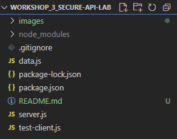
 </p>

---

## 4️⃣ Реалізовані ендпоінти

| HTTP Метод | URL | Опис | Необхідні заголовки | Тіло запиту (JSON) | Можливі коди відповіді |
|-------------|-----|------|----------------------|----------------------|---------------------------|
| **GET** | `/documents` | Отримати всі документи | `X-Login`, `X-Password` | — | 200 OK, 401 Unauthorized |
| **POST** | `/documents` | Додати новий документ | `X-Login`, `X-Password` | `{ "title": "Text", "content": "Text" }` | 201 Created, 400 Bad Request, 401 Unauthorized |
| **DELETE** | `/documents/:id` | Видалити документ за ID | `X-Login`, `X-Password` | — | 204 No Content, 401 Unauthorized, 404 Not Found |
| **GET** | `/employees` | Отримати список співробітників | `X-Login`, `X-Password` (роль `admin`) | — | 200 OK, 401 Unauthorized, 403 Forbidden |

---

## 5️⃣ HTTP-коди, що підтримуються сервером

| Код | Значення | Коли використовується |
|------|-----------|-----------------------|
| **200 OK** | Запит виконано успішно | GET /documents, GET /employees |
| **201 Created** | Створено новий ресурс | POST /documents |
| **204 No Content** | Видалення виконано | DELETE /documents/:id |
| **400 Bad Request** | Невірні дані у запиті | Відсутній title або content |
| **401 Unauthorized** | Неавторизований користувач | Немає або некоректні X-Login / X-Password |
| **403 Forbidden** | Немає прав доступу | Користувач без ролі admin звертається до /employees |
| **404 Not Found** | Ресурс не знайдено | Видалення неіснуючого документа |

---

## 6️⃣ Демонстрація роботи через Postman

У теці `docs/` або безпосередньо тут можна додати скріншоти, що підтверджують роботу API:

- ✅ Успішний запит `GET /documents`  
- ❌ Запит без заголовків → **401 Unauthorized**  
- ⚠️ Запит користувача `user1` до `/employees` → **403 Forbidden**  
- ✅ Успішний запит адміністратора `admin1` до `/employees`  
- ❌ Запит на видалення неіснуючого документа → **404 Not Found**

> 💡 Всі запити протестовані у Postman та повертають очікувані статуси HTTP.

## 🧪 Демонстрація роботи API у Postman

### 1. Отримання документів — 200 OK (GET /documents)

<p align="center">
  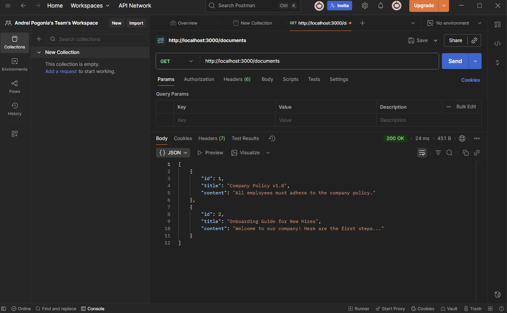
</p>

### 2. Отримання масиву співробітників — 200 OK (GET /employees)

<p align="center">
  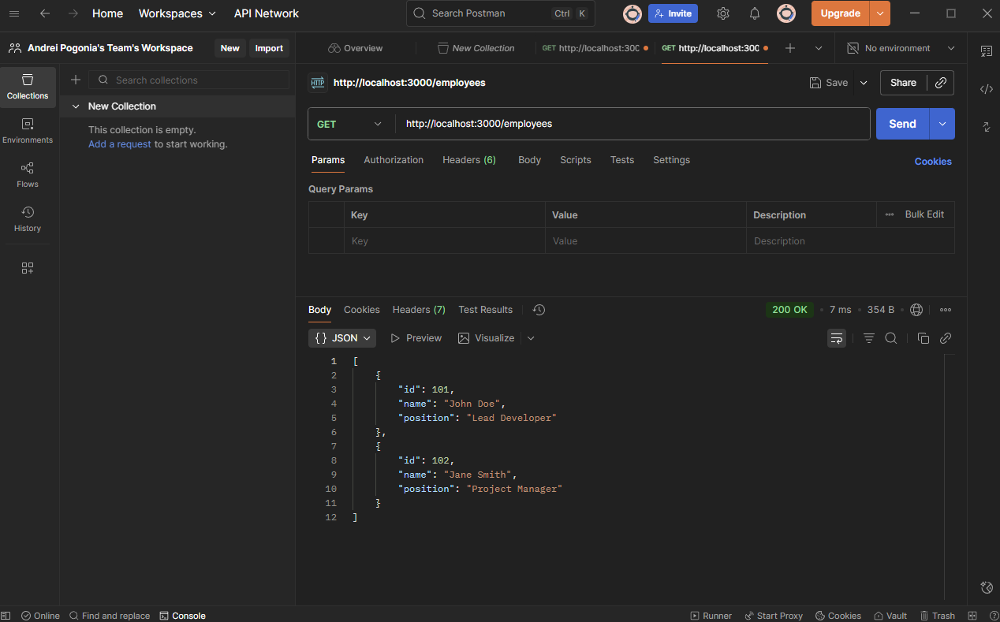
</p>

### 3. Створення документа — 201 Created (POST /documents)

<p align="center">
  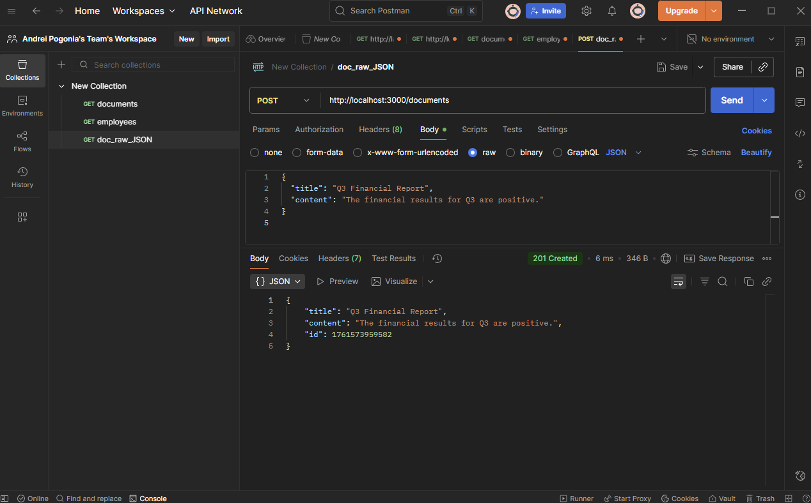
</p>

### 4. Оновлений список документів — 200 OK (GET /documents після створення)

<p align="center">
  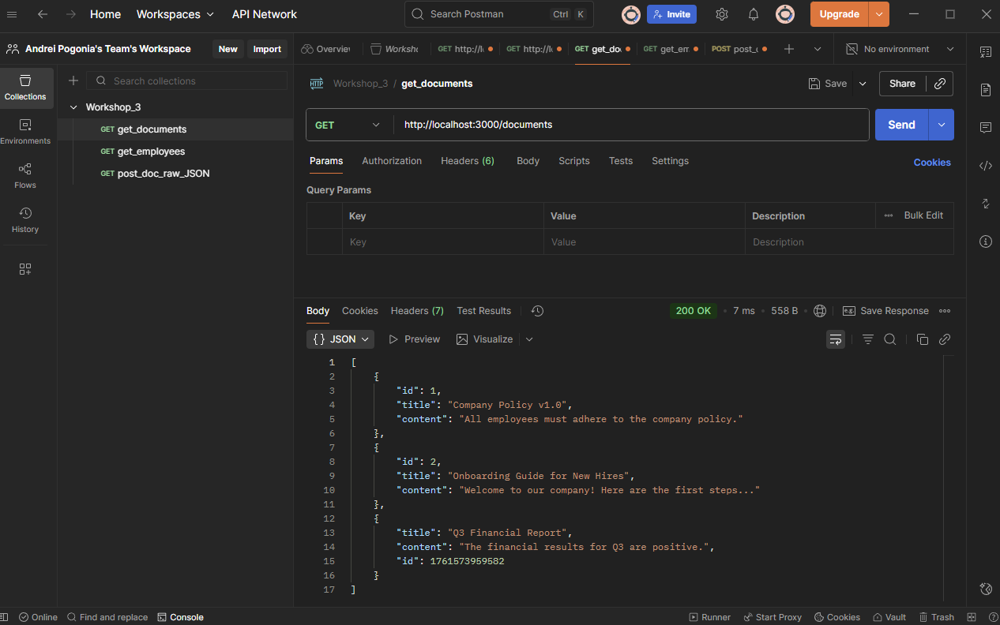
</p>

### 5. Спроба без авторизації — 401 Unauthorized (GET /documents)

<p align="center">
  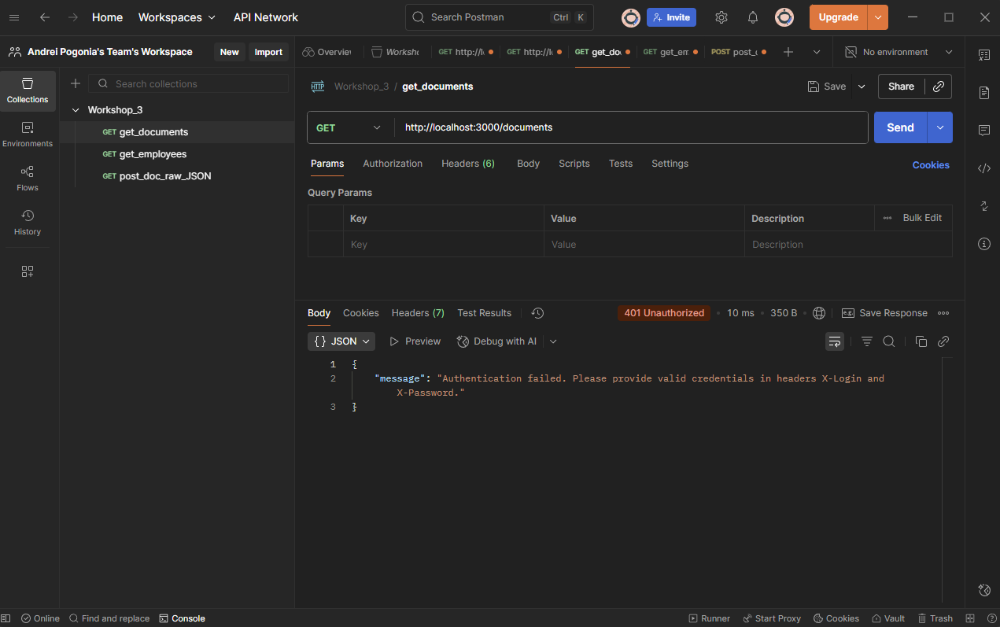
</p>

### 6. User отримує список співробітників (200 OK)

<p align="center">
  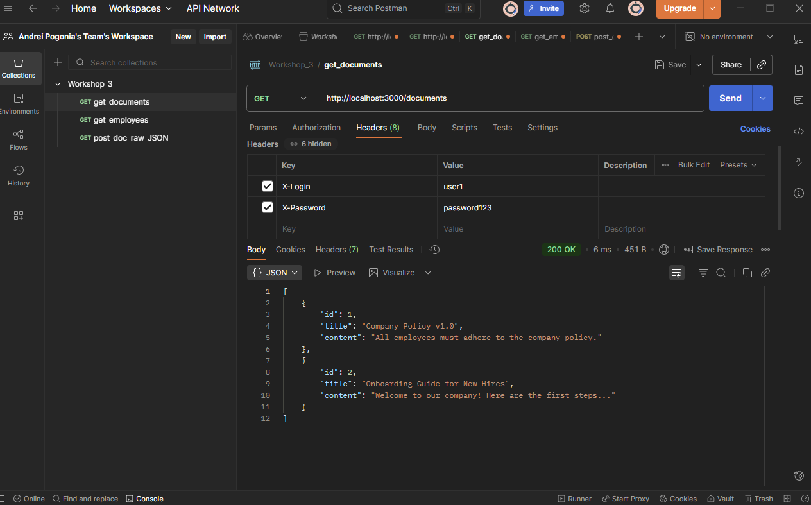
</p>

### 7. User без прав доступу до /employees (403 Forbidden)

<p align="center">
  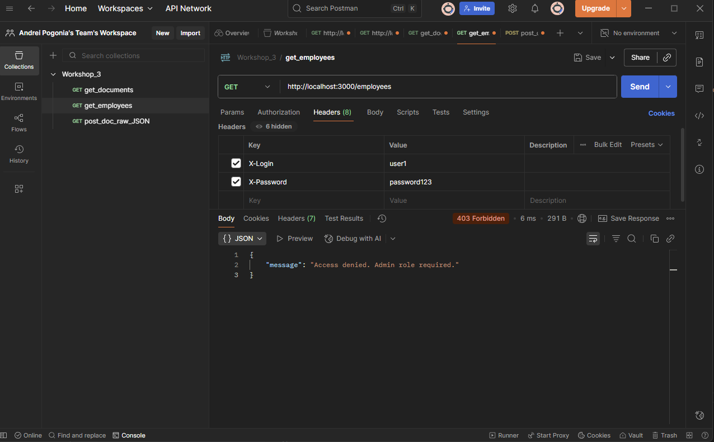
</p>

### 8. Доступ до /employees як admin (200 OK)

<p align="center">
  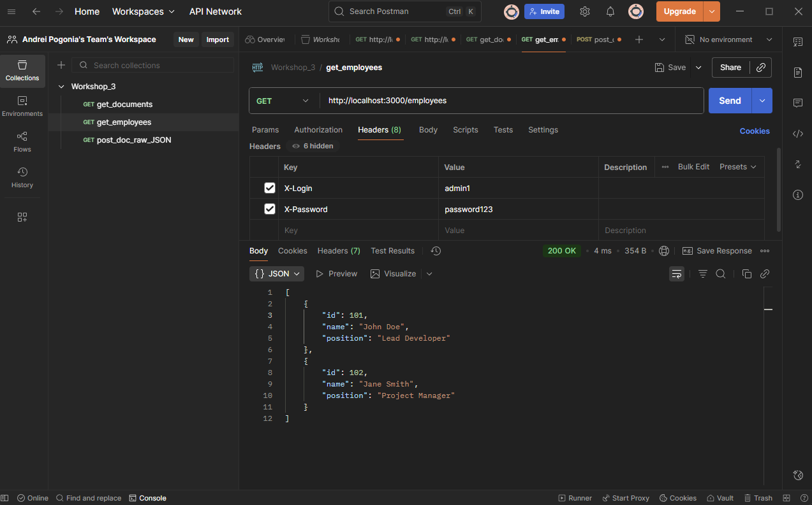
</p>

### 9. Спроба створення документа без title (JSON тіло)

<p align="center">
  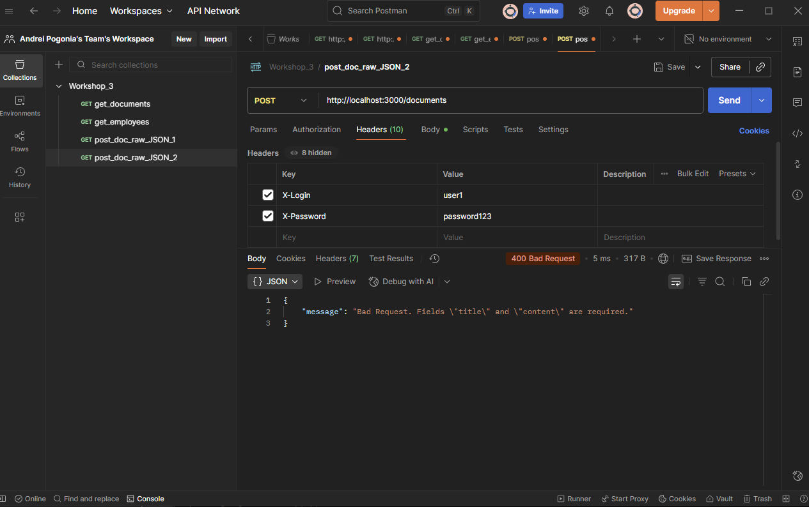
</p>

<p align="center">
  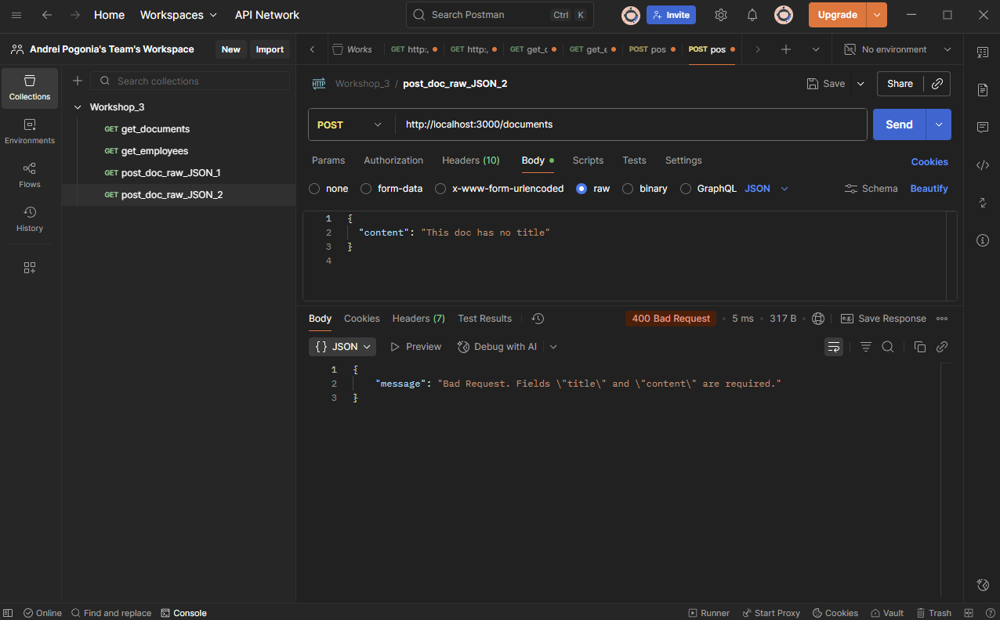
</p>

### 10. Успішне видалення документа (204 No Content)

<p align="center">
  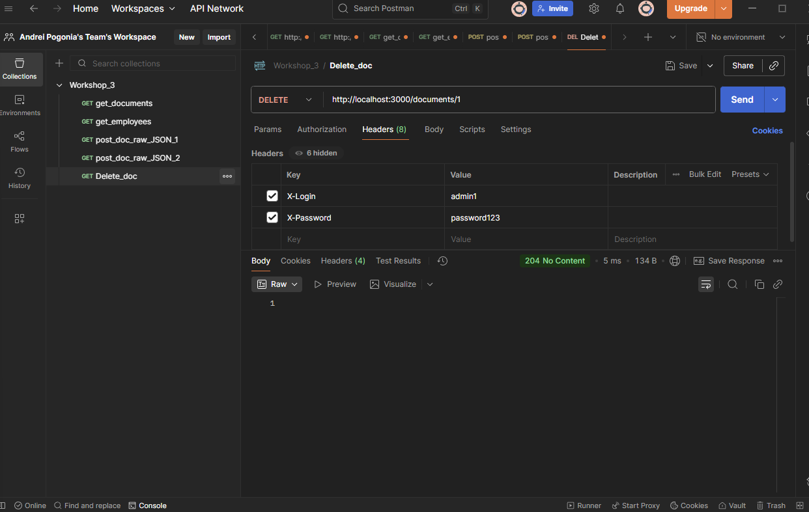
</p>

### 11. Видалення неіснуючого документа (404 Not Found)

<p align="center">
  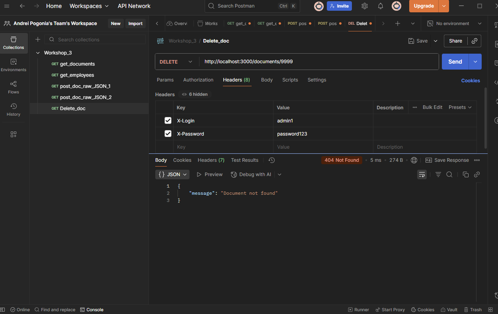
</p>

---

## 💻 Демонстрація роботи через Bash

### 🧩 1. Клонування репозиторію, ініціалізація npm і встановлення залежностей

<p align="center">
  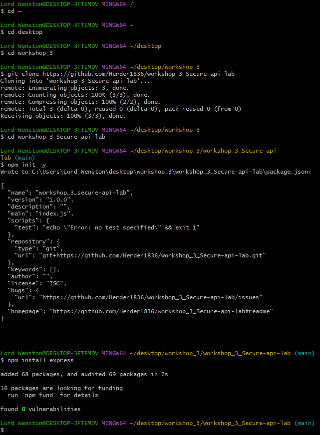
</p>

### ▶️ 2. Запуск сервера Node.js

<p align="center">
  
</p>

### 🌐 3. Перевірка сервера у браузері

<p align="center">
  
</p>

### 📝 4. Перший commit і push у GitHub

<p align="center">
  
</p>

### 🔐 5. Commit з аутентифікацією та логуванням

<p align="center">
  
</p>

### 🕒 6. Сервер показує логи GET/POST-запитів

<p align="center">
  
</p>

### 🗑️ 7. Логи DELETE-запитів

<p align="center">
  
</p>

### 🧪 8. Результати тестового клієнта `npm test`

<p align="center">
  
</p>

### 🚀 9. Завершальний commit і push

<p align="center">
  
</p>

---

## 7️⃣ Тестовий клієнт `test-client.js`

Файл демонструє автоматичні звернення до API для перевірки базових сценаріїв:

- Отримання списку документів як звичайний користувач (200 OK).  
- Спроба отримати список співробітників як користувач (403 Forbidden).  
- Успішне отримання списку співробітників як адміністратор (200 OK).

### 📋 Запуск тестів:
```bash
npm test
```

### 📈 Очікуваний результат у терміналі:
```
--- Running API Tests ---
[TEST 1] GET /documents as user
Status: 200
...
[TEST 2] GET /employees as user
Status: 403
...
[TEST 3] GET /employees as admin
Status: 200
...
--- Tests finished ---
```

---

## 8️⃣ Посилання на публічний репозиторій

🔗 [Переглянути репозиторій GitHub](https://github.com/Herder1836/workshop_3_Secure-api-lab)
🔗 [Переглянути коміти в репозиторії GitHub](https://github.com/Herder1836/workshop_3_Secure-api-lab/commits/main/)

---

## 9️⃣ Приклади логів сервера

```
[2025-10-27T16:20:01.541Z] GET /documents
[2025-10-27T16:20:05.002Z] POST /documents
[2025-10-27T16:20:15.300Z] DELETE /documents/1
```

---

## 🔟 Вимоги, яких дотримано

✅ Окремий публічний репозиторій  
✅ Мінімум 5 комітів зі змістовними повідомленнями (Conventional Commits)  
✅ Структура файлів відповідає вимогам  
✅ Використано Express  
✅ Реалізовано middleware для логування, автентифікації, авторизації  
✅ Всі ендпоінти працюють  
✅ Правильні HTTP статуси  
✅ Файл `.gitignore` ігнорує `node_modules/`  
✅ Тестовий клієнт демонструє роботу через `npm test`  
✅ README.md містить усю необхідну документацію

---
